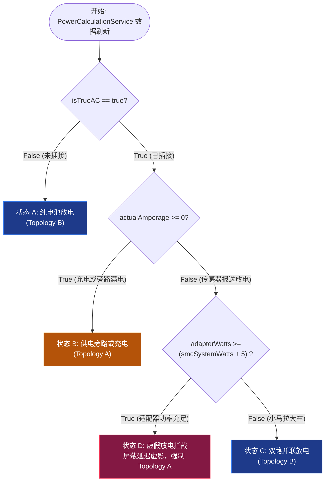

# 供电拓扑与桑基图状态机 (Power Topology & Sankey State Machine)

本文档定义了 `PowerCalculationService` 的能量流动状态机逻辑以及 `SankeyPowerFlowView` 对这些状态的具体可视化渲染表现。这些状态机规则主要为了解决 Apple 底层 API (`IOKit` 与 `SMC`) 的传感器采集时间差与设备插拔瞬间的“虚假并存幽灵管线”问题。

## 1. 物理事实与传感器延迟模型

系统依靠两种不同特性的传感器采集电源状态：
1. **高频响应传感器 (AC Power & SMC)**: 判断当前是否插电 (`isTrueAC`) 以及实时系统整机耗电 (`smcSystemWatts` / PSTR)。更新延迟极低（~ 毫秒级）。
2. **低频响应传感器 (IOKit AppleSmartBattery)**: 负责判断电池的输入输出电流 (`amperage`) 以及部分适配器的静态功率协商 (`adapterWatts`)。在发生剧烈物理状态改变（插拔电源）时，通常有 2 - 10 秒 的更新滞后（Lag）。

## 2. 能量拓扑状态机 (Topology States)

系统由以下条件约束并强制覆写错误状态：

### 状态 A：纯电池放电 (Unplugged Discharging)
- **触发条件**: `isTrueAC == false`
- **逻辑覆写**: 由于物理上未连接电源，电池绝对不可能处于正在充电状态。
- **强制输出**: 
  - `isCharging = false`, `isDischarging = true`
  - `topology = .topologyB`
  - `adapterWatts = 0.0`, `systemWatts = smcSystemWatts ?? batteryWatts`
- **桑基图表现**:
  - 主管线: `Battery Node (蓝色)` $\xrightarrow{}$ `System Node`
  - 没有任何 Adapter 图标或副管线（并列管线）。

### 状态 B：供电旁路或充电 (Adapter Main / Charging / Bypass)
- **触发条件**: `isTrueAC == true` 且 `actualAmperage >= 0` 
  - (或当 `actualAmperage < 0`，但判定为传感器重度延迟滞后而强行修正，见 状态 D)。
- **逻辑**: 电源适配器为目前唯一主动供电源，无论电池处于进食状态（充电）还是处于满电摸鱼状态（旁路停滞）。
- **强制输出**:
  - `isDischarging = false`
  - `topology = .topologyA`
  - 无论何时，`systemWatts` 强绑定为 `smcSystemWatts`（优先），`trueAdapterWatts` 累加系统所需与电池充电所需之和。
- **桑基图表现**:
  - 主管线: `Adapter Node (黄色)` $\xrightarrow{}$ `System Node`
  - 副管线（如充电）: `Adapter Node` $\xrightarrow{}$ `Battery Charging Node (绿色)`

### 状态 C：双路并联放电 (Parallel Discharging Due to Weak AC)
- **触发条件**: `isTrueAC == true` 且 `actualAmperage < 0` 且 `adapterWatts` **确实不足以** 覆盖系统功耗。
- **逻辑**: 通常见于强负载情况下插入了一个极低功率的手机头（例如 20W 充电头），导致 Adapter 满载后，系统依然不得不从电池抽血。两者是真实的平行并存关系。
- **强制输出**:
  - `isCharging = false`, `isDischarging = true`
  - `topology = .topologyB`
- **桑基图表现**:
  - 主管线: `Adapter Node (黄色)` $\xrightarrow{}$ `System Node`
  - 副管线: `Battery Node (蓝色)` $\xrightarrow{}$ `System Node`

### 状态 D：虚假放电拦截 (Ghost Transient Interception)
- **触发条件**: `isTrueAC == true` 且 `actualAmperage < 0`，且 `adapterWatts >= (smcSystemWatts + 5.0)`。
- **逻辑**: 最致命的状态组合。用户刚插上适配器，PD 协议已经握手反馈了高额的 `adapterWatts`（如 100W充电器），但此时底层的电池 `amperage` 回报机制仍处于僵死状态（报告比如 -30W 放电）。此时由物理守恒定律得知：系统只有 30W 的负载，而适配器足以提供 100W 的输入，那么电池绝对不可能还在放电！这完全是控制器的延迟虚像。
- **操作**: 
  - 强行切断并重置其逻辑判定，将放电虚像抹杀，强行跃迁至 **状态 B (旁路/充电)**。
  - `isDischarging = false`, `topology = .topologyA`
- **桑基图表现**: 
  - 从视觉上立即抹除双路管线中由于滞后而产生冻结卡死的现象，瞬间将拓扑重归为：`Adapter Node` $\xrightarrow{}$ `System Node`。

## 3. 状态机决策流图 (Decision Flowchart)

## 4. 渲染表现矩阵总结
| 物理状态 | 底层 `isTrueAC` | 底层 `Amperage` | 拓扑结果 | UI管线显示 |
| :--- | :---: | :---: | :---: | :--- |
| **真·拔掉** | False | -30W | `topologyB` | 只有一个 `Battery -> System` 主管线 |
| **虚·未同步**| False | +10W | 被拦截，强制转为 `topologyB` | 同上（瞬间屏蔽掉依然宣称自己还没断奶的虚影） |
| **正常充电** | True | +20W | `topologyA` | 主管线: `Adapter -> System`   副管线: `-> Battery(充电)` |
| **旁路满电** | True | 0W | `topologyA` | 绝大多数场景，主管线 `Adapter -> System` |
| **伪·小马拉大车** | True | -30W，但 Adapter 报告为 100W | 被拦截，强制转为 `topologyA` | 屏蔽平行供电，仅显示 `Adapter -> System` (完美解决 UI 过渡期满屏小部件僵死的问题) |
| **真·小马拉大车** | True | -30W，且 Adapter 确实只有 10W | `topologyB` | 并行管线: `Adapter -> System` 与 `Battery -> System` 齐飞 |

这份详细的校验机制正是 MacStatus 在苹果非实时的电池 API 下，依然能构建出能够与 AlDente / 官方系统UI 相媲美的极其丝滑柔顺的拓扑交互体验的基石。
